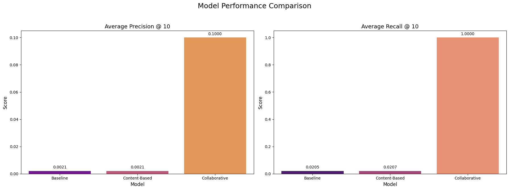
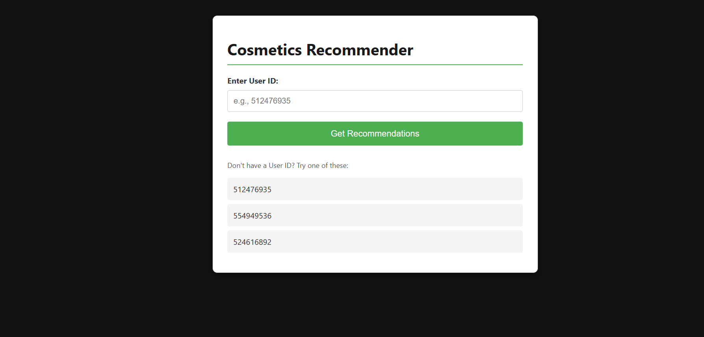

# Behavioral Product Recommendation System

Build a personalized, end-to-end product recommendation system using real user behavior from an online cosmetics store. From data cleaning and implicit ratings to real-time API deployment — this project simulates the backbone of modern recommendation engines.

---

## 📌 Project Overview

Most e-commerce platforms struggle to convert browsing activity into personalized shopping experiences. This project bridges that gap by using real customer interaction data (views, carts, purchases) to recommend relevant products tailored to each user’s behavior.

---

## 💡 Problem Statement

Without explicit ratings or reviews, it's difficult to understand what users want. Yet behavioral cues — like viewing or purchasing a product — are valuable signals. This project focuses on:

- **Converting implicit feedback into usable ratings**
- **Recommending personalized products in real-time**
- **Balancing business goals (e.g., increasing conversion) with user satisfaction**

---

## 🛠️ Tools & Technologies

- **Python (Pandas, Scikit-learn):** Data wrangling and modeling
- **scikit-surprise:** Collaborative Filtering (SVD) and evaluation
- **Matplotlib & Seaborn:** Exploratory Data Analysis
- **Flask:** REST API for recommendation delivery

---

## 🔍 Key Steps

### ✅ Data Preparation
- Cleaned ~4M interaction records from an e-commerce cosmetics store
- Handled missing `brand` and `category_code` fields with placeholder categories
- Engineered:
  - `rating` (view = 1, cart = 2, purchase = 4)
  - `day_of_week`, `hour` (from timestamp)
- Used a single month’s data (~300K rows) for focused development

### 📊 Exploratory & Behavioral Analysis
- **Funnel Analysis:** Tracked user journey from view → cart → purchase
- **Top Performers:** Identified highest-selling products and brands
- **Price vs Action:** Visualized purchase behavior across price ranges

### 🤖 Recommendation Modeling
- **Models Compared:**
  - Popularity-based (non-personalized)
  - Content-Based Filtering (TF-IDF on product titles)
  - Collaborative Filtering using **SVD**
- **Winner:** SVD model (best Precision@K, Recall@K)
- **Hyperparameter Tuning:** Used `GridSearchCV` for optimized recall and RMSE

  

---

## ⚙️ Flask API & Deployment

Deployed a production-ready API using Flask:

- **Endpoint:** `/recommend/<user_id>`
- **Response:** JSON with top-10 product IDs recommended for that user
- **Optimization:**
  - Trained model saved via `pickle`
  - API loads pre-trained objects at startup for faster performance

    

---

## 📈 Key Outcomes

- Converted raw clickstream data into meaningful, ranked product recommendations
- Delivered a **real-time REST API** that personalizes the shopping experience
- Demonstrated strong handling of **implicit feedback**—a critical challenge in modern recommender systems

---

## 🚀 How to Use

1. Clone this repository  
2. Install dependencies via `requirements.txt`  
3. Run `app.py`  
4. Visit `http://localhost:5000/recommend/<user_id>` to test recommendations  
5. Check `notebooks/` for full EDA, model comparisons, and evaluation

---

## 📁 Dataset

- Source: [Kaggle - E-commerce Behavior Data from a Cosmetics Store](https://www.kaggle.com/datasets/mkechinov/ecommerce-behavior-data-from-multi-category-store)
- Size: 20M+ event logs across several months  
- Sampled one month (~4M rows) for modeling

---
## 📄 License

This project is licensed under the [MIT License](LICENSE).

---

## 📬 Contact

Naman Kumar

📧 Email: namankr24@gmail.com

🔗 GitHub: NamanKr24
